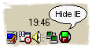



## Show Or Hide All Your Internet Explorer Windows With One Single Mouse Click\!

### Description

Show Or Hide All Your Internet Explorer Windows With One Single Mouse Click. Compleet Version!...

Would you like to have a new and better version with a automatic update function and with more options? then VOTE IT! U just like it? just VOTE IT! and I will release the new version soon, because the new version is almost ready to release!...
 
### More Info
 

             |
---                |---
**Submitted On**   |2001-08-12 20:07:22
**By**             |[MAGiC MANiAC^mTo](https://github.com/Planet-Source-Code/PSCIndex/blob/master/ByAuthor/magic-maniac-mto.md)
**Level**          |Beginner
**User Rating**    |5.0 (30 globes from 6 users)
**Compatibility**  |VB 6\.0
**Category**       |[Internet/ HTML](https://github.com/Planet-Source-Code/PSCIndex/blob/master/ByCategory/internet-html__1-34.md)
**World**          |[Visual Basic](https://github.com/Planet-Source-Code/PSCIndex/blob/master/ByWorld/visual-basic.md)
**Archive File**   |[Show Or Hi245278122001\.zip](https://github.com/Planet-Source-Code/magic-maniac-mto-show-or-hide-all-your-internet-explorer-windows-with-one-single-mouse-cli__1-26125/archive/master.zip)

